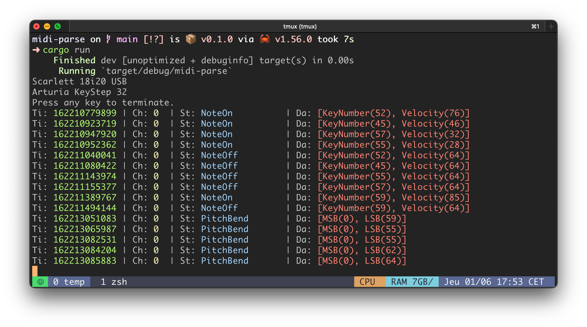

# mumuse


[](https://docs.rs/mumuse/latest/mumuse/)
[](https://crates.io/crates/mumuse)


Small music theory library with MIDI capabilities written in Rust *(wip)*.  

---
## Examples

### Creating notes and transpositions

```rust 
// Declare Note from &str
let _a = Note::try_from("C0").unwrap();

// Declare from struct
let n = Note::new(Letter::C, 2);
println!("Note : {}", n);

// Transpose up by one Fifth
let fifth = n + Interval::Fifth;
println!("Fifth up : {}", fifth);

// Transpose down by one Octave
let octave = n - Interval::Octave;
println!("Octave down : {}", octave);
```

---

### Chords, transpositions and inversions

```rust 
// From an str Vec directly
let chord_from_str = Chord::from(vec!["C4", "E4", "G4"]);
println!("From str vector : {}", chord_from_str);

// Inversions
let first_inv = chord_from_str.invert(1);
let second_inv = chord_from_str.invert(2);
println!("First inversion : {}", first_inv);
println!("First inversion : {}", second_inv);

// Transpositions
let chord_one_fifth = chord_from_str.clone() + Interval::Fifth; // Chord is not Copy
let chord_one_octave_down = chord_from_str.clone() - Interval::Octave;
println!("Fifth up : {}", chord_one_fifth);
println!("Octave down : {}", chord_one_octave_down);
```

---

### Build scales and chords from scales

```rust 
// Declare a root note
let root = Note::try_from("C0").unwrap();

// Declare vector of intervals
let intervals = vec![Interval::MajorSecond, Interval::Fifth];

// Declare scale from root and intervals and print it
let scale = Scale::new(root, intervals);
println!("{}", scale);

// Declare existing scales
let major_scale = Scale::major(root);
println!("{}", major_scale);

// Construct Chord from Scale degree
let one_chord = Scale::major(root).one(3); // 3 notes chord
let five_chord = Scale::major(root).five(4); // 4 notes chord
println!("I chord of C Major Scale : {}", one_chord);
println!("V7 chord of C Major Scale : {}", five_chord);
```

---

### Play with chords and secondary dominants

```rust 
// Secondary dominants function
fn get_five(scale: &Scale, degree: usize) -> Chord {
    Scale::major(scale.notes()[degree-1]).five(4)

// Declare a root note
let root = Note::try_from("C3").unwrap();
let major_scale = Scale::major(root);

// Fill with chords
let chords = (1..6).map(|degree| major_scale.by_degree(degree, 3).invert(2));
let secondary_dominants = (1..6).map(|degree| get_five(&major_scale, degree+1));

// Play them through midi
// midi::show_output_ports(); // show output ports
let mut conn_out = midi::get_output_connection("Virtual Midi Bus 1".to_string());
for (chord, second) in chords.zip(secondary_dominants) {
    chord.send_midi_with_duration(&mut conn_out, 500, 64);
    second.send_midi_with_duration(&mut conn_out, 500, 64);
```
---

### Modes too

```rust 
// Declare a root note
let root = Note::try_from("C0").unwrap();

// Declare major scale
let major_scale = Scale::major(root);
println!("{}", major_scale);

// Construct modes
let ionian = major_scale.mode(1); // Does not change anything on Major scale
let dorian = major_scale.mode(2);
let phrygian = major_scale.mode(3);

// Print scales
println!("{ionian}");
println!("{dorian}");
println!("{phrygian}");
```
---

### Receive MIDI messages from Device

```rust 
midi::show_input_ports();
midi::receive("Arturia KeyStep 32".to_string());
```

<p align="center">
  
</p>

---